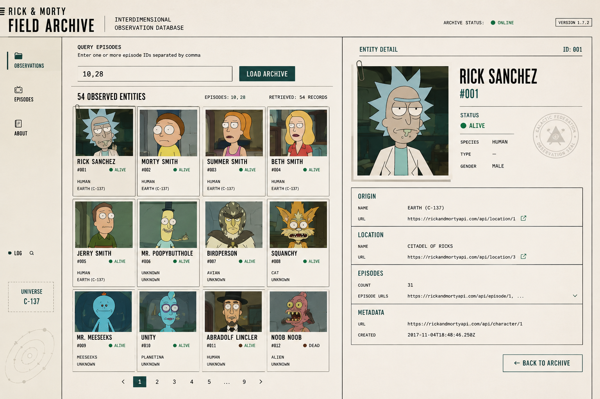

# Rick and Morty Frontend



Frontend em React para o [rick-morty-backend](../rick-morty-backend).

## Stack

- React + TypeScript (Vite)
- Tailwind CSS v4 (tema centralizado via `@theme` em [src/index.css](./src/index.css))
- React Hook Form
- TanStack Query
- Axios (services REST)
- Vitest + Testing Library
- ESLint (`typescript-eslint`, type-checked)

> **Nota de versão:** o `typescript` deste projeto está fixado em `^6.0.x`. A versão `7.x` (usada no backend) ainda
> não é suportada pelo `typescript-eslint` ([issue #10940](https://github.com/typescript-eslint/typescript-eslint/issues/10940)),
> e o lint com checagem de tipos é um requisito deste projeto.

## Instalação

```bash
npm install
cp .env.example .env
```

## Rodando

```bash
npm run dev
```

Por padrão espera o backend em `http://localhost:3000` (variável `VITE_API_URL`).

## Testes e qualidade

```bash
npm test         # vitest
npm run test:watch
npm run lint      # eslint (type-checked)
npm run build     # tsc -b && vite build
```

## Estrutura

```
src/
  constants/  # tokens não-visuais: paginação, mensagens, grid templates, tema de status
  utils/      # funções puras (validação de IDs, paginação, formatação) — testadas isoladamente
  hooks/      # useEpisodeQuery, useObservedEntities, usePagination, useSelectedEntity
  services/   # services REST por recurso (consomem o httpClient)
  lib/        # configuração de bibliotecas (query client, cliente HTTP axios)
  types/      # tipos compartilhados com o backend
  components/
    common/     # StatusIndicator, EntityPortrait
    layout/     # ArchiveHeader, ArchiveSidebar, ArchiveWorkspace
    query/      # EpisodeQueryForm
    entities/   # grid, card, skeleton, paginação, estados vazio/erro
    detail/     # painel de detalhe da entidade selecionada
  pages/
    FieldArchivePage.tsx  # composition root da tela
  test/       # setup do ambiente de testes e fixtures
  App.tsx     # monta a página
  main.tsx    # entrypoint (providers)
```
